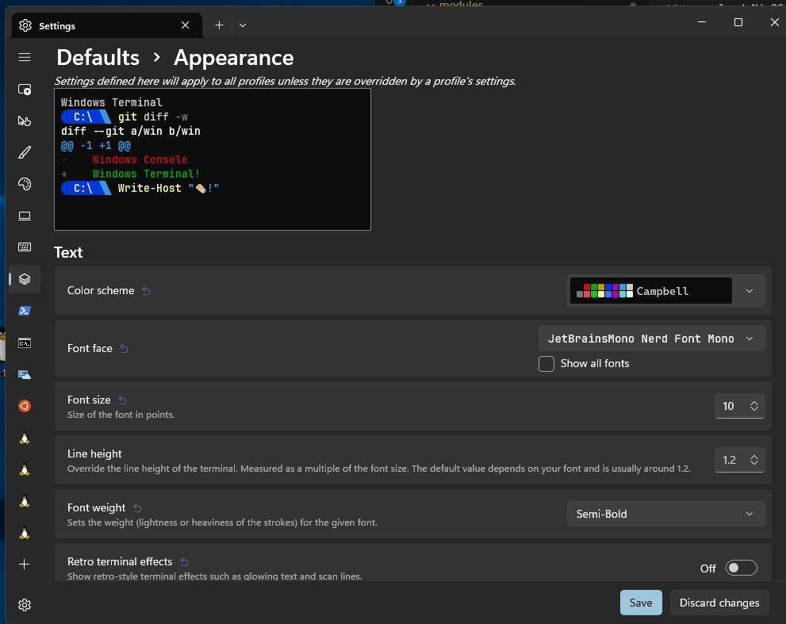

# Setup WSL Distro

The structure of this repo is based on: https://github.com/LGUG2Z/NixOS-wsl-starter

Download _nixos-wsl.tar.gz_ from: https://github.com/nix-community/NixOS-WSL/releases (tested with version _23.5.5.2_).

```
# remove existing WSL distro if required
# wsl --unregister NixOS

# import downloaded NixOS-WSL distro
wsl --import NixOS D:\code\wsl\NixOS\ D:\code\wsl\nixos-wsl.tar.gz --version 2

# start distro
wsl -d NixOS

# setup NixOS 23.11 channel
sudo nix-channel --add https://nixos.org/channels/nixos-23.11 nixos
sudo nix-channel --update

# avoid issues by creating a vscode settings file first:
# mkdir -p ~/.config/Code/User
# touch ~/.config/Code/User/settings.json
```

See section [Development](#Development) or [Install from Remote Flake](#Install-from-Remote-Flake) for next steps

## Create Windows shortcuts to WSL distribution

```
C:\Windows\System32\wsl.exe --distribution NixOS --cd "~"
```

## Mount existing .ssh folder from Windows

Only needs to be performed once:

```
WINDOWS_USER=$(/mnt/c/Windows/System32/WindowsPowerShell/v1.0/powershell.exe '$env:UserName' | tr -d '\r')
echo $WINDOWS_USER
ln -s /mnt/c/Users/$WINDOWS_USER/.ssh ~
# if required:
# sudo chown nixos:users ~/.ssh
# sudo chmod 700 ~/.ssh/
# sudo chmod 600 ~/.ssh/id_rsa

# test connection
ssh -T git@github.com
```

## Pot. Setup Git-Credentials-Manager (https repos)

```
gpg --gen-key
#<enter email>
...
gpg --list-keys
pass init <gpg-id> <- identified via gpg --list-keys

# adjust expiration (if required)
gpg --quick-set-expire <gpg-id> 0
gpg --quick-set-expire <gpg-id> 0 '*'
```

## Setup VcXsrv on Windows

Download and install _VcXsrv_ on Windows https://sourceforge.net/projects/vcxsrv/files/latest/download

Create shortcut: `"C:\Program Files\VcXsrv\xlaunch.exe" -run "C:\code\config.xlaunch"`

**config.xlaunch**:

```xml
<?xml version="1.0" encoding="UTF-8"?>
<XLaunch WindowMode="MultiWindow" ClientMode="NoClient" LocalClient="False" Display="-1" LocalProgram="xcalc" RemoteProgram="xterm" RemotePassword="" PrivateKey="" RemoteHost="" RemoteUser="" XDMCPHost="" XDMCPBroadcast="False" XDMCPIndirect="False" Clipboard="True" ClipboardPrimary="False" ExtraParams="" Wgl="False" DisableAC="True" XDMCPTerminate="False"/>
```

**Note**: Windows Firewall rules might need to be created (**Inbound Rules**) for _VcXsrv_.<BR/>
**Note**: Pot. use https://community.chocolatey.org/packages/vcxsrv#files (includes Firewall Rules).<BR/>
**Note**: add shortcut to Windows autostart.

# Install from Remote Flake

Apply this configuration without needing to clone this repo:

```
sudo nixos-rebuild switch --flake github:rstauch/nix-config#nixos

# pot. open up new shell:
exit # from wsl
wsl -t NixOS

# or use previously created shortcut
wsl -d NixOS

# cleanup
gc && refresh

# afterwards apply (remote) updates with:
hmur
```

# Development

```

# provide git (if required)
# nix-shell -p git

# clone repo
mkdir -p ~/projects/int
cd ~/projects/int
git clone https://github.com/rstauch/nix-config.git

cd ~/projects/int/nix-config
# current remote config
git remote -v

# set remote to ssh
git remote set-url origin git@github.com:rstauch/nix-config.git

# verify results
git remote -v

# avoid issues by creating a vscode settings file (if required)
mkdir -p ~/.config/Code/User
touch ~/.config/Code/User/settings.json

# apply updates
cd ~/projects/int/nix-config
nix flake update
sudo nixos-rebuild switch --flake .#nixos

# reconnect to WSL shell (if required)
exit # (nix shell)
exit # (wsl)
wsl -t NixOS
wsl -d NixOS
```

Edit with VSCode:

```
cd ~/projects/int/nix-config
code .

# or run:
hme
```

Apply changes:

```
cd ~/projects/int/nix-config
sudo nixos-rebuild switch --flake .#nixos

# or run:
hmu
```

# WSL Backup & Restore

```
# wsl --export <Image Name> <Export location file name.tar>
wsl --export NixOS P:\Backup\WSL\NixOS.tar

# restore
# wsl --import <Image Name> <Directory where you want to store the imported image> <Directory where the exported .tar file exists>
wsl --import NixOS D:\code\wsl\NixOS P:\Backup\WSL\NixOS.tar
```

# Windows Terminal Setup (wip)

## Shortcuts

add the following to the Windows Terminal _settings.json_ file:

- horizontal split = _ctrl+shift+minus_
- vertical split = _ctrl+shift+plus_
- close pane = _ctrl+shift+w_

```json
{
  "command": {
    "action": "splitPane",
    "split": "down",
    "splitMode": "duplicate"
  },
  "keys": "ctrl+shift+minus"
},
{
  "command": {
    "action": "splitPane",
    "split": "vertical",
    "splitMode": "duplicate"
  },
  "keys": "ctrl+shift+plus"
}
```

## Font settings

Basis: [link](https://github.com/LGUG2Z/nixos-wsl-starter/issues/2)<BR>
Install all JetBrainsMono NerdFont files in Windows by _Right Clicking and selecting Install Fonts_<BR>
Set the following appeareance Settings in Windows Terminal:
<BR>
<BR>

### Oh-My-Posh

Basis:

- [YouTube](https://www.youtube.com/watch?v=-G6GbXGo4wo&ab_channel=TroubleChute)<BR>
- [Docs](https://ohmyposh.dev/docs/installation/windows)<BR>
- [Tut](https://learn.microsoft.com/en-us/windows/terminal/tutorials/custom-prompt-setup#customize-your-powershell-prompt-with-oh-my-posh)<BR>

Powershell:

```
# upgrade powershell
winget install --id Microsoft.Powershell --source winget

winget install JanDeDobbeleer.OhMyPosh -s winget
# apply updates (if required)
winget upgrade JanDeDobbeleer.OhMyPosh -s winget

## restart terminal

# generate install default theme command
oh-my-posh init pwsh --config "$env:POSH_THEMES_PATH\jandedobbeleer.omp.json"
## copy output and run in terminal:
# (@(& 'C:/Users/tresb/AppData/Local/Programs/oh-my-posh/bin/oh-my-posh.exe' init pwsh --config='C:\Users\tresb\AppData\Local\Programs\oh-my-posh\themes\jandedobbeleer.omp.json' --print) -join "`n") | Invoke-Expression
```

check themes at: https://ohmyposh.dev/docs/themes or via `Get-PoshThemes`

```
Install-Module PSReadLine -Force
Install-Module -Name Terminal-Icons -Repository PSGallery -Force

New-Item -Path $PROFILE -Type File -Force
notepad $PROFILE

# add the following lines:
oh-my-posh init pwsh --config 'C:\Users\tresb\AppData\Local\Programs\oh-my-posh\themes\fish.omp.json' | Invoke-Expression
Set-PSReadLineOption -PredictionSource History
Set-PSReadLineOption -PredictionViewStyle ListView
Set-PSReadLineOption -BellStyle None
Set-PSReadLineOption -MaximumHistoryCount 10000

. $PROFILE

# restart Windows Terminal
```

---

# TODO

- starship prompt ?
- document shortcuts
- structure to include nix-darwin config (by hostname)
- github actions pipeline
- remove vscode initial manual step
- dotfiles ?
- nicht funktionierende vscode plugins
  (s. evtl. https://github.com/orgs/community/discussions/33392#discussioncomment-3696373)
  - hancel.markdown-image

```

```
